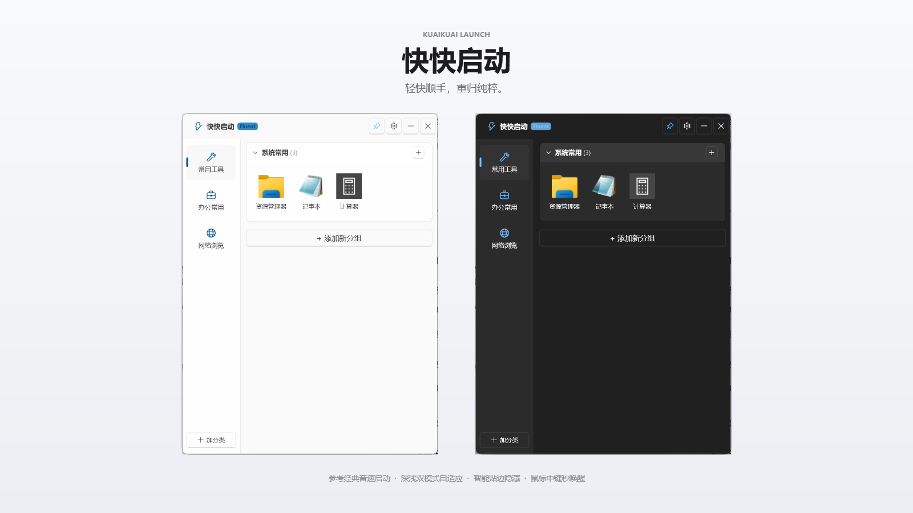
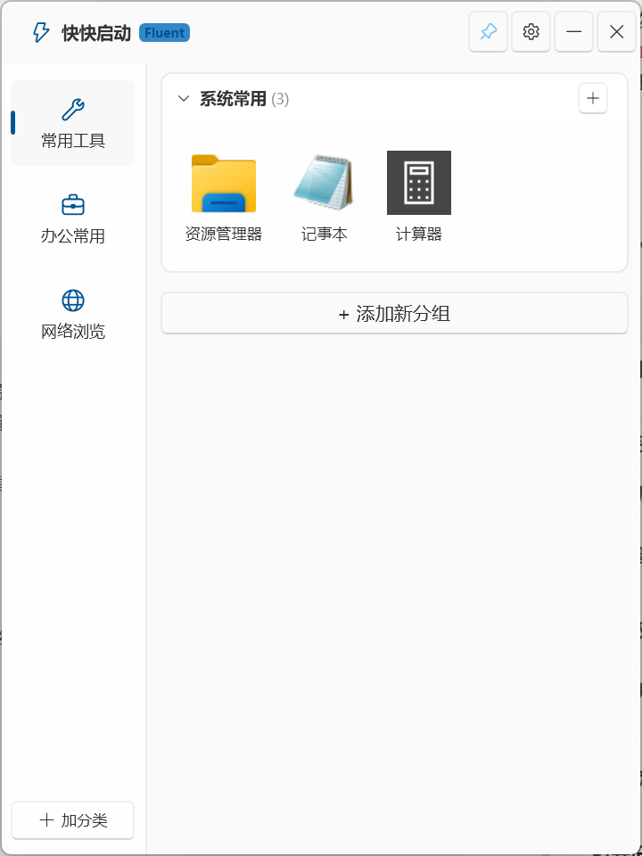
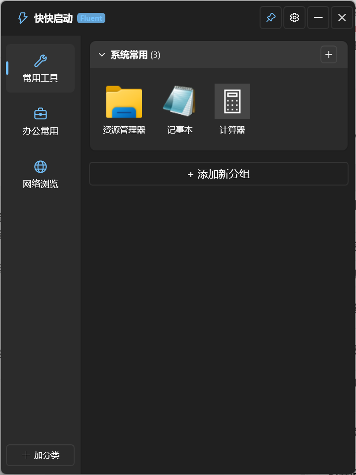

# 快快启动 (KuaiKuai Launch)

<p align="center">
  
</p>

<p align="center">
  一个简单轻量、支持边缘吸附与鼠标中键呼出的 Windows 桌面快捷启动工具<br>
  <em>参考经典老牌软件「音速启动」，基于 WPF / .NET 10 随手做的小工具</em>
</p>

---

> ### 💬 写在前面
> 
> 以前很喜欢用经典的「音速启动」，小巧实用，后来原版软件早早停更了，高分屏下也有些模糊。
> 
> 现在的 AI 时代确实很强大，在 AI 辅助下一天时间就能自己复刻出一个类似的软件，做出来平时能用一下，图个顺手方便。
> 
> 基础功能基本都做齐了：边缘停靠自动隐藏、鼠标中键秒呼出、分类分组、高清图标提取、文件网页直接拖拽添加等，满足日常桌面快速启动的需求。

---

## 🌟 核心特性

- 🎨 **现代化 Fluent 2 视觉体验**
  - 原生 Acrylic 亚克力背景与毛玻璃微质感。
  - 支持暗黑 (Dark) 与浅色 (Light) 主题自适应。
  - 精巧卡片化布局、丝滑微动效及高对比度排版。

<p align="center">
  
  &nbsp;&nbsp;
  
</p>

- 🧲 **智能屏幕边缘吸附与自动隐藏 (Edge Dock & Auto-Hide)**
  - **贴边吸附**：将窗口拖拽至屏幕上、左、右边缘（≤ 16 像素阈值）时，自动触发边缘停靠。
  - **自动隐藏**：贴边状态下，鼠标移出窗口 300ms 后自动平滑滑出隐藏，仅保留屏幕边缘极细呼出条；鼠标悬停呼出条或边缘时即刻滑出还原。
  - **自由拖离**：拖拽标题栏离开屏幕边缘时，智能解除吸附状态，随心定位至桌面任意位置。

- ⚡ **多通道全局秒级唤醒 (Instant Summon)**
  - **鼠标中键（滚轮点击）全局呼出/隐藏**：基于低级 Win32 鼠标钩子，在桌面、网页或全屏游戏中单击鼠标滚轮中键，即可秒级呼出或隐藏启动面板。
  - **全局快捷键**：默认支持 `Alt + Q`（可在设置中自定义修饰键与按键）。
  - **系统托盘常驻**：原生 Win32 系统通知区域托盘图标，支持单双击呼出、右键便捷控制菜单。

- 📌 **一键窗口置顶 (Always On Top)**
  - 标题栏右侧直观图钉图标，高亮即时显示置顶状态。
  - 单击图钉一键切换置顶 / 取消置顶，底层精确联动 Win32 `HWND_TOPMOST` / `HWND_NOTOPMOST`。

- 📂 **层级化分类与分组管理**
  - **左侧分类栏**：支持添加自定义分类、配置 Fluent Symbol 图标、重命名与拖拽排序。
  - **右侧分组卡片**：支持折叠/展开分组，清晰归类工作办公、开发工具、游戏娱乐、网络网址等不同项目。

- 🚀 **文件与网页极速拖拽添加 (Drag & Drop)**
  - 支持直接将快捷方式 (`.lnk`)、可执行文件 (`.exe`)、批处理脚本 (`.bat`, `.cmd`)、普通文档、文件夹目录或浏览器网址链接 (`https://...`) 拖入窗口任一分组中。
  - 自动解析 Windows Shell 快捷方式真实路径、启动参数、工作目录与描述。

- 🖼️ **256x256 Jumbo 超高清图标无损提取**
  - 基于 Windows Shell `SHGetImageList` 原生接口提取 256x256 Jumbo 超大尺寸高清图标。
  - 自动持久化生成本地无损 PNG 图标缓存，彻底告别传统启动工具图标模糊、失真的困扰。

- 💾 **全绿色便携化设计 (Portable)**
  - 配置与数据全本地化存储于程序目录下的 `data/` 目录中。
  - 支持 `%APP_DIR%` 相对路径标记，拷贝至移动硬盘或 U 盘即插即用。
  - 内置支持 Windows 系统原生工具直接启动（如 `explorer.exe`, `notepad.exe`）及网址默认浏览器调用。

---

## 🛠️ 技术栈与架构

| 模块 | 技术方案 | 说明 |
| :--- | :--- | :--- |
| **运行时** | .NET 10.0 (Windows) | 最新高性能运行时，现代 C# 13 特性 |
| **GUI 框架** | WPF (Windows Presentation Foundation) | 经典成熟的桌面渲染与 XAML 布局引擎 |
| **UI 设计系统** | WPF-UI (`Wpf.Ui`) | 遵循 Windows 11 Fluent 2 规范的控件库 |
| **架构模式** | MVVM (Model-View-ViewModel) | 视图与业务逻辑高度解耦 |
| **基础库** | `CommunityToolkit.Mvvm` | 高性能命令与属性绑定源生成器 |
| **底层交互** | Win32 P/Invoke & Shell COM | `RegisterHotKey`, `SetWindowsHookEx`, `IShellLinkW`, `IImageList` |

### 项目工程目录结构

```text
快快启动/
├── App.xaml / App.xaml.cs            # WPF 应用程序入口
├── MainWindow.xaml / .xaml.cs        # 主面板窗口（亚克力外观、拖拽、吸附、动画）
├── Models/                           # 核心数据模型
│   ├── AppSettings.cs                # 全局应用设置实体
│   ├── Category.cs                   # 分类实体（左侧导航）
│   ├── ShortcutGroup.cs              # 快捷分组实体
│   └── ShortcutItem.cs               # 快捷项目实体（目标路径、参数、图标）
├── ViewModels/                       # MVVM 视图模型
│   ├── MainViewModel.cs              # 主界面业务驱动
│   ├── CategoryViewModel.cs          # 分类展示与编辑驱动
│   ├── ShortcutGroupViewModel.cs     # 分组驱动
│   ├── ShortcutItemViewModel.cs      # 单项驱动（点击启动、编辑、统计）
│   └── SettingsViewModel.cs          # 系统配置对话框驱动
├── Views/                            # 界面与对话框
│   ├── Controls/ShortcutTile.xaml    # 快捷项目卡片组件
│   └── Dialogs/                      # 属性编辑与设置窗口
├── Services/                         # 核心服务层
│   ├── AutoStartService.cs           # 开机自启注册表服务
│   ├── EdgeDockService.cs            # 屏幕边缘智能吸附与隐藏检测
│   ├── HotkeyService.cs              # Win32 全局热键注册管理
│   ├── IconExtractorService.cs       # 256x256 高清图标提取与 PNG 缓存
│   ├── LauncherService.cs            # 进程与网址启动调度器
│   ├── LnkParserService.cs           # ShellLink 快捷方式与文件解析
│   ├── MouseHookService.cs           # 鼠标中键全局低级钩子
│   ├── StorageService.cs             # JSON 数据持久化与便携路径转换
│   ├── TrayIconManager.cs            # 系统托盘与右键通知菜单
│   └── Win32/NativeMethods.cs        # Win32 底层 API 声明
└── tests/                            # 自动化测试项目
    └── ServiceTests.cs               # 单元测试集合
```

---

## 🚀 快速上手与编译

### 1. 环境准备
- 操作系统：Windows 10 (1903+) 或 Windows 11
- 开发环境：[.NET 10 SDK](https://dotnet.microsoft.com/download) 或 Visual Studio 2022 / VS Code

### 2. 获取代码与编译

```powershell
# 进入代码根目录
cd KuaiKuaiLaunch

# 还原依赖项
dotnet restore

# 运行单元测试
dotnet test tests/KuaiKuaiLaunch.Tests.csproj

# 编译 Release 版本
dotnet build -c Release
```

### 3. 运行程序
编译产物位于：  
`bin\Release\net10.0-windows\KuaiKuaiLaunch.exe`

直接双击启动即可！首次启动将自动初始化默认分类与快捷工具，并常驻右下角任务栏托盘。

---

## 📖 操作指南

| 操作 | 快捷方式 / 动作 | 说明 |
| :--- | :--- | :--- |
| **唤醒/隐藏主面板** | 鼠标中键（滚轮点击） | 全局有效，随时随地一键呼出或隐藏 |
| **热键呼出** | `Alt + Q` | 支持在设置窗口中自定义 |
| **置顶切换** | 单击标题栏图钉 📌 图标 | 高亮代表窗口处于最顶层 |
| **拖动窗口** | 鼠标按住标题栏任意空白区域拖拽 | 拖出吸附范围即可自由放置 |
| **边缘吸附** | 将窗口拖拽靠近屏幕左/右/上边缘 | 靠近边缘 16px 范围即可自动吸附 |
| **添加快捷方式** | 从桌面/文件夹直接拖拽文件或网址入窗 | 自动生成高清图标与名称 |
| **管理项目** | 鼠标右键点击卡片 | 支持运行、以管理员身份运行、编辑属性、删除等 |
| **打开设置** | 点击左下角齿轮 ⚙️ 图标 | 配置开机自启、主题、热键、吸附行为等 |

---

## 📄 说明与参考

- **参考软件**：交互逻辑与功能主要参考了老牌经典的 **音速启动 (VStart)**。
- **纯粹实用**：无广告、不联网、纯本地绿色便携，配置与数据全在 `data/` 目录中，满足自己日常顺手使用的需要。
